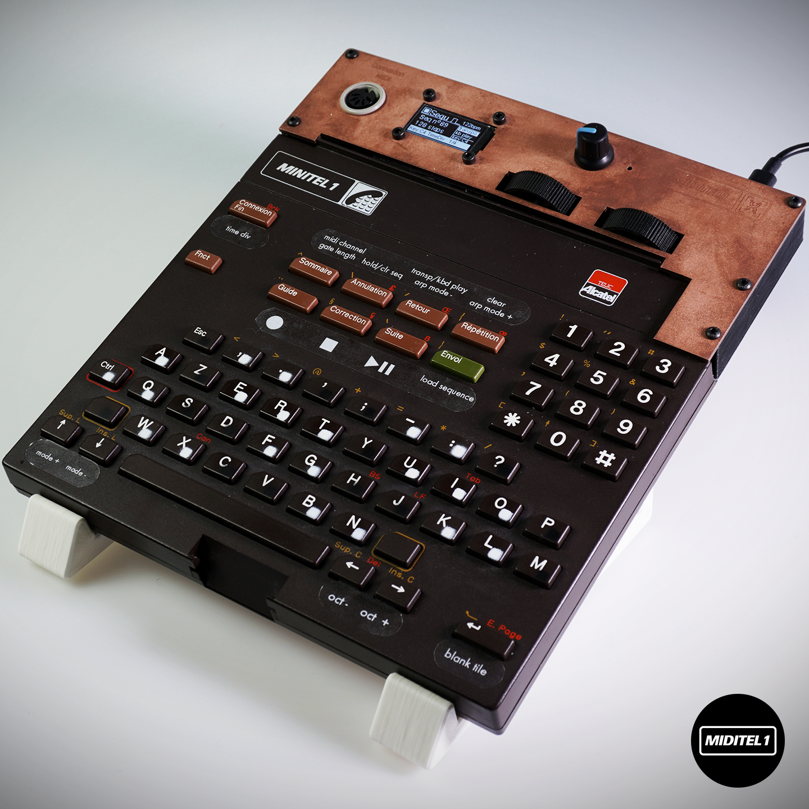

# MIDITEL, a MIDI keyboard using a Minitel keyboard

# Description

The Miditel is a Midi keyboard built with a Mini-tel keyboard. The key layout is inspired by an accordion keyboard. Its features are highly inspired by the Arturia Keystep including Normal play, sequencer, or arpeggiator. In addition, it embedded a small Oled screen and give unique a multi-sequencer feature

**The project is based on the MINITEL 1.**

# Hardware

You will need a miditel 1 keyboard with a working keyboard matrix, the PCB which can be found in the [hardware/PCB](hardware/PCB), an 1.3 inch [OLED Display module by waveshare](https://www.waveshare.com/1.3inch-oled-module-c.htm)

# Software

The project run on a raspberry pico 1 with micropython. To this date, it is working under v1.27.0. Download latest micropython image on [Micropython website](https://micropython.org/download/RPI_PICO/).

You then need to transfer .py files and .pbm (pictures) files on the little fs of the pico. All the .py files, all the .pbm files and the folder arp_mode with all its .pbm files.
Here is what the structure should look like.

- arp_mode
  - dwn.pbm
  - dwnx2.pbm
  - ...
- arial6.py
- arial8.py
- arial10.py
- font6.py
- font10.py
- keyboardConfiguration.py
- main.py
- OLED_SPI.py
- writer.py
- lxb64x64.pbm
- pause.pbm
- play.pbm
- rec.pbm
- stop.pbm

## About Minitel

Remove the keyboard from your minitel. You will then connect the ribbon cable of the minitel to a serie of wire and then to J3, the 17 pins connector on the PCB. All the info about the minitel keyboard and its matrix can be found on [entropie.org](https://entropie.org/3615/index.php/2020/08/05/le-clavier-du-minitel-1b/)

## Manufacturing Files

### PCB

The PCB to control the miditel files can be found in the [hardware/PCB](hardware/PCB) folder. I personnaly used [PCBWay](https://www.pcbway.com) service to produce the PCB.

The PCB is as simple double sided PCB.

### Front panel

The manufacturing files of the front panel can be found in the [hardware/FrontPanel](hardware/FrontPanel) folder. It has been made to cnc machine and laser engrave a front panel. They can also be easily converted to make the front panel of a PCB which is a cheaper option.
The Front panel is composed of the following files:

- Top_Platev004 files : the front panel with the cutout
- Top_Plate_design-only : only the "aestetic" part
- Top_Plate_outer_shape : only the "cutout" part

In my original design, the front panel has been made using [PCBWay](https://www.pcbway.com) Sheet Metal Fabrication service. I chose bead-blasted copper with custom laser engraving to fit the color of the Minitel Keyboard.

### 3D printed parts

The manufacturing files of the front panel can be found in the [hardware/3DPrinting](hardware/3DPrinting) folder.

- Bottom_Platev004.3mf : bottom plate that hold the PCB and is glued directly on the minitel
- Wheelv004.3mf : wheel to put on the potentiometers
- paint stencil folder : 3d printable stencil to paint white and black square on the key of the minitel

### LICENSE

[CC BY-NC-SA](https://creativecommons.org/licenses/by-nc-sa/4.0/)

This license enables reusers to distribute, remix, adapt, and build upon the material in any medium or format for noncommercial purposes only, and only so long as attribution is given to the creator. If you remix, adapt, or build upon the material, you must license the modified material under identical terms. CC BY-NC-SA includes the following elements:

BY: credit must be given to the creator.
NC: Only noncommercial uses of the work are permitted.
SA: Adaptations must be shared under the same terms.
